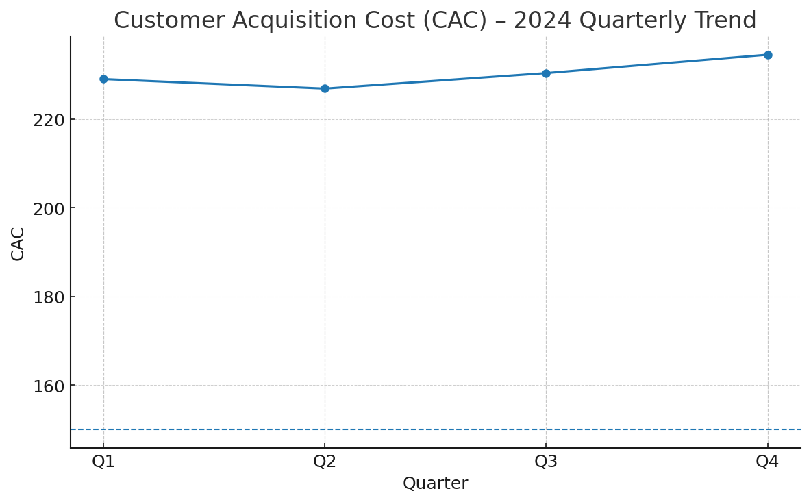

# Financial Services Performance Analysis: Customer Acquisition Cost (CAC)

Prepared by **22ds3000189@ds.study.iitm.ac.in**  
Generated with LLM assistance (ChatGPT Codex / Jules).

## Dataset (2024)
Quarterly CAC values and the industry benchmark target of **150**.

| Quarter | CAC |
|--------:|----:|
| Q1 | 228.99 |
| Q2 | 226.84 |
| Q3 | 230.35 |
| Q4 | 234.49 |

**Average CAC (2024): 230.17**

**Benchmark Target:** 150

### Gap vs Benchmark (CAC - 150)
- Q1: **78.99**
- Q2: **76.84**
- Q3: **80.35**
- Q4: **84.49**

From **Q1 (228.99)** to **Q4 (234.49)**, CAC increased by **5.5** (≈ **2.4%**).

## Visualization
The chart below shows the CAC trend with the benchmark line at 150.



## Key Findings
1. CAC remained elevated all year with an **average of 230.17**, well above the **target of 150**.
2. The gap to benchmark worsened in Q4 (**84.49** above target), despite a brief improvement in Q2.
3. Trend indicates **rising acquisition costs** into year-end, suggesting budget pressure and potential channel inefficiencies.

## Business Implications
- **Profitability pressure:** Elevated CAC compresses margins and lengthens payback periods.
- **Budget allocation risk:** Over-investment in high-CAC channels likely crowding out more efficient alternatives.
- **Growth headwinds:** Without optimization, scaling acquisition will be increasingly expensive and slower.

## Recommendations — _Optimize Digital Marketing Channels_
To reach the target **150**, prioritize a rigorous optimization program across the funnel:

### Channel Mix & Bidding
- Shift spend toward lower-CAC sources (e.g., high-intent search, affiliates, referrals).
- Tighten audience targeting and negative keywords; adopt value-based bidding strategies.
- Cap CAC at ad-set/campaign level; enforce automated guardrails.

### Creative & Landing Pages
- Systematic creative tests (hooks, formats, CTAs); refresh cadence each sprint.
- Improve landing speed (Core Web Vitals) and relevance; minimize form friction.
- Personalize copy to high-intent segments; align message-match from ad to page.

### Measurement & Attribution
- Enforce clean conversion tracking (server-side where possible).
- Use MMM/MTA triangulation to identify true ROI; cut underperformers fast.
- Implement lift experiments for big bets (geo holdouts, PSA controls).

### Conversion Rate & LTV
- Iterate onboarding flows; remove blockers and add proof (trust, pricing clarity).
- Strengthen lifecycle marketing (email/SMS in first 7–30 days).
- Target higher-LTV cohorts; align bonuses to **LTV:CAC ≥ 3:1**.

### Operating Cadence
- Weekly performance reviews with clear owner + action log.
- Channel scorecards (CAC, CVR, AOV/LTV) with stop/start/continue decisions.
- Quarterly rebalancing of mix based on proven efficiency.

> **Solution (as requested):** **Optimize digital marketing channels** with the tactics above to drive CAC down toward the **150** benchmark.

## Reproducibility
```bash
pip install -r requirements.txt
python analyze_cac.py
# Prints: "Average CAC (2024): 230.17" and saves outputs/cac_trend.png
```

## LLM Assistance
This analysis, code, and narrative were generated with the assistance of **ChatGPT Codex (Jules)** / ChatGPT.  
Include this note and commit messages referencing LLM assistance to make provenance explicit.

_PR created with ChatGPT Codex (Jules)._)
